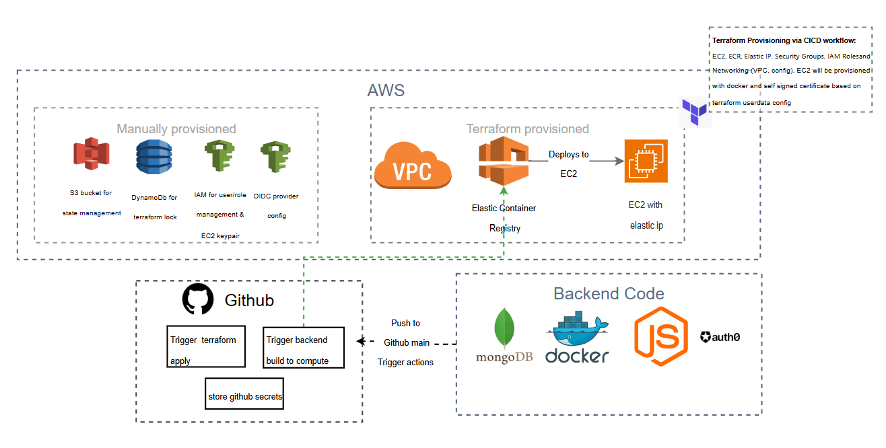
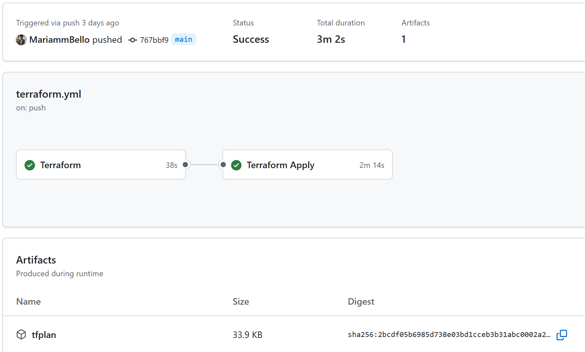
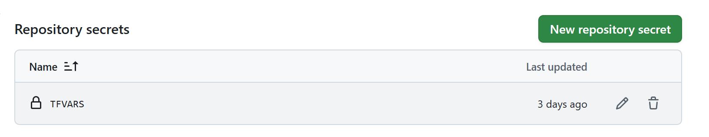

# A Free tier MVP Backend Application Deployment Guide (AWS EC2, ECR + Terraform + GitHub Actions)

***A write-up based on contributions to recent projects - Althub***

This write up serves the purpose of documenting a project contribution and as handover notes for other developers in the team. It aims at achieving a reproducible outcome for any cloud engineers who take on a similar project with the same requirements. A Free tier MVP deployment. ***You can find alternative non free tier choices that are even more efficient given a budget, as part of the link at the end of this write up.***

## Architecture Overview


Terraform apply via cicd: How to best prepare for provisioning resources collaboratively for your project. What do these mean for a Cloud Engineer.

### Here´s a back story

You are working on one of your first MVP projects as a new cloud engineer, you relax and think you just have to wait your turn, well not really. You may think your role starts when the backend application is ready, but there are ways to prepare for a minimal level deployment.

There are two scenarios for your task execution.
 - You are building from scratch.
 - This project has been handed off to your team. 

 Lets detail the first scenario. If this becomes a natural understanding, you can fit into other scenarios. 

What are you working on?
A backend application deployment that aims at ensuring that an application is up and running, using free tier resources. This write up excludes monitoring and logging for the sake of simplicity.

So here´s your first milestone: JUST HIT TERRAFORM APPLY... ofcourse via collaborative practice. Stay with me to see how I did it so you can too!

## Prerequisites

*   **AWS Account IAM Access:** An active AWS account access for a terraform-admin, with all necessary permissions to ensure least privilege.
*   **GitHub Account:** A GitHub account to host the repositories.
*   **Git Repositories:**
    1.  `the-project-name-infra`: Contains only the Terraform code for infrastructure deployments.
    2.  `the-project-name-backend`: As a cloud engineer, you need to be involved in ensuring the backend team can deploy their code to your deployment framework. The backend team repository should contain the backend code, `Dockerfile`, and application CICD (deployment) workflow.
*   **Tools Installed Locally:**
    *   Git
    *   Terraform CLI
    *   AWS CLI
    *   Docker
*   **Secure Storage:** A method to securely store sensitive credentials (e.g., password manager). This versions stores secrets in Git, to optimise for low cost.
*   **EC2 Key Pair:** An EC2 Key Pair created in your target AWS region for SSH access. The **private key** file will be needed for GitHub Secrets.
*   **Your Public IP Address:** Needed to restrict SSH access in `terraform.tfvars`. You can find this by searching "what is my IP" in a web browser.


## Phase 1: Initial Cloud & Account Setup (One-Time - DevOps Role)
1.  **Create AWS Account:** If not set up.
    *   Sign up for an AWS account at [aws.amazon.com](https://aws.amazon.com/).
    *   **Security Best Practice:** Secure your root user account (enable MFA, create an admin IAM user for daily tasks, and avoid using the root user).
    *   Set up billing alerts to monitor costs.

2.  **Create IAM User for Initial Setup & Local Testing:**
    *   In the AWS IAM console, create a new IAM user (e.g., `terraform-admin`). This user is primarily for the *initial manual setup* (like creating the backend) and for *local testing* if needed. The CI/CD workflows will use dedicated IAM Roles later.
    *   Grant this user **Programmatic access** (generate Access Key ID and Secret Access Key).
    *   **Store these credentials securely.**
    *   Attach policies granting necessary permissions. For initial setup, `AdministratorAccess` is simplest, but **refine to least privilege** after initial setup. Minimally, it needs permissions for S3 (create/manage Terraform backend bucket), DynamoDB (create/manage Terraform backend table), IAM (create OIDC provider, create roles), VPC, EC2, ECR, and potentially CloudWatch Logs.

3.  **Configure Local AWS CLI:**
    *   Configure your local AWS CLI with the `terraform-admin` user credentials if you plan to run Terraform commands locally on your terminal. You can do so by entering the downloaded Access Key ID and Secret Access Key. The region and output format for the resources are based on the admin´s deployment requirements. default is "us-east-1" and "json".
        ```bash
        aws configure
        # Enter Access Key ID:
        # Enter Secret Access Key:
        # Enter default region:
        # Enter default output format:
        ```

4.  **Create EC2 Key Pair (Manual):**
    *   You need an EC2 Key Pair to securely SSH into the EC2 instances created by Terraform. Create one in the AWS region where you plan to deploy your infrastructure (e.g., `us-east-1`).
    *   **Using the AWS Management Console**
        1.  Navigate to the EC2 service in the AWS Console.
        2.  In the left navigation pane, under "Network & Security", click "Key Pairs".
        3.  Click "Create key pair".
        4.  Enter a **Name** for your key pair (e.g., `your-project-name-dev-key`). This name is what you will use for the `ec2_key_name` variable in `terraform.tfvars`. A sample source code can be seen in my public [github repo](https://github.com/MariammBello/Free-tier-MVP-Deployment-Guide).
        5.  Choose the key pair type (RSA or ED25519) and private key file format (`.pem` for OpenSSH on Linux/Mac, `.ppk` for PuTTY on Windows). `.pem` is generally recommended.
        6.  Click "Create key pair".
        7.  **Crucially, your browser will automatically download the private key file (`.pem` or `.ppk`). Save this file in a secure location.** You cannot download it again later. This file is needed for direct SSH access and, if setting up application deployment (Phase 3.5), for the `EC2_SSH_PRIVATE_KEY` GitHub Secret.

5.  **Create Terraform Backend Resources (Manual):**
    *   Using the AWS console or the configured AWS CLI, create the following resources in your desired primary AWS region (e.g., `us-east-1`):
        *   **S3 Bucket:**
            *   Name: Choose a globally unique name (e.g., `terraform-state-your-project-name-dev`).
            *   Enable **Versioning**.
            *   Enable **Server-side encryption**.
            *   Block all public access.
        *   **DynamoDB Table:**
            *   Name: Choose a unique name (e.g., `terraform-lock-your-project-name-dev`).
            *   Primary key: `LockID` (Type: String).
            *   Use default settings (On-demand capacity is fine).

## Phase 2: Initial Infrastructure Provisioning (DevOps Role)

6.  **Clone Infra Repo & Configure Backend:**
    *   Clone your `your-project-name-infra` repository locally. You can clone mine here: [github repo](https://github.com/MariammBello/Free-tier-MVP-Deployment-Guide).
    *   Navigate to `your-project-name-infra/environments/dev`.
    *   Edit `backend.tf`:
        *   Update the `bucket` value to the exact S3 bucket name created in Step 5.
        *   Update the `dynamodb_table` value to the exact DynamoDB table name created in Step 5.
        *   Ensure the `region` matches where you created the backend resources.

7.  **Prepare Terraform Variables (Dev Environment):**
    *   Still in `your-project-name-infra/environments/dev`:
    *   create a `terraform.tfvars` file (make sure to add to .gitignore)
        *   Fill in non-sensitive variable values, such as these samples:

        ```hcl
        # Environment-specific variables for the 'dev' workspace.
        # This file should be added to .gitignore

        project_name = "Your project's base name" 
        environment  = "environment for deployment (dev, stage, production)"           

        # --- AWS Dev Values ---
        aws_region = "Your target AWS deployment region (e.g., 'us-east-1')"

        # VPC Configuration: Define your network layout
        vpc_cidr             = "10.10.0.0/16"
        private_subnet_cidrs = ["10.10.1.0/24"] 
        public_subnet_cidrs  = ["10.10.101.0/24"] 

        # EC2 Configuration: Define your EC2 instance configuration
        ec2_instance_type = "e.g., 't2.micro' (ensure it's free-tier eligible if desired)"            
        ec2_key_name      = "<EC2 Key Pair Name created earlier in step 4>"
        allowed_ssh_cidr_blocks = ["0.0.0.0/0"]  
        allowed_app_cidr_blocks = ["0.0.0.0/0"]  

        # ECR Configuration
        ecr_repo_name = "Base name for your desired ECR repository (e.g., 'backend-app')" 
        ecr_image_tag = "Initial tag (e.g., 'latest'). CI/CD will deploy specific tags later"
        ```

*   `allowed_ssh_cidr_blocks`: **Replace `["YOUR_IP/32"]` with a list containing your actual public IP address followed by `/32`. Example: `["1.2.3.4/32"]`. This is crucial for security.**
*   `allowed_app_cidr_blocks`: Keep as `["0.0.0.0/0"]` if the API needs to be publicly accessible via HTTP/HTTPS, or restrict as needed.

8.  **Commit Configuration & Prepare for First CI/CD Run for Terraform deployment:**
    *   **Prerequisite:** Ensure the full CI/CD setup described in **Phase 3 (Steps 10-13)** is completed *before* proceeding with this step. This includes configuring the OIDC provider, creating the necessary IAM Roles for both workflows, setting up the GitHub Environment, configuring secrets in the backend repo, and verifying the workflow files.
    *   **Local Validation (Recommended):** From the `your-project-name-infra/environments/dev` directory, run: This is recommended even if the actual deployment will be via CI/CD.
        ```bash
        # Ensure your local AWS CLI is configured if you want to run plan locally (Step 3)
        terraform init      # Initializes providers and backend configuration
        terraform validate  # Check syntax
        terraform plan      # Review planned changes locally (optional but recommended)
        ```
        *Running `terraform plan` locally here helps catch configuration errors before committing.*
    *   **Commit & Push:** Once validated locally, commit all the configured infrastructure code in the `environments/dev` directory, the `.github/workflows/terraform.yml` file, and all modules to your `your-project-name-infra` repository.
        *   **Option A (Direct Push - Simpler for initial setup):** Push directly to the `main` branch, triggering a workflow.
        *   **Option B (PR Workflow):** Push to a feature branch and create a Pull Request targeting `main`.
    *   **Triggering First Apply:**
        *   If you pushed directly to `main`, the infrastructure workflow (`terraform.yml`) will trigger automatically.
        *   If you created a PR, the workflow will run `plan` and comment on the PR. Once you merge the PR, the workflow will trigger again on `main.


The workflow will execute `terraform apply`, creating all the core infrastructure (VPC, EC2, ECR, etc.) for the first time and populating the state file in your S3 backend. **This CI/CD run replaces the need for a manual local `apply`.**


***Manual Approval: Depending on the organisational set up in Github, the workflow run on the `main` branch can pause and require manual approval in the GitHub Actions tab. This is a different topic coverage outside the scope of this write up***
    

9.  **Retrieve Initial Terraform Outputs:**
    *   After the **first successful run** of the infrastructure CI/CD workflow on the `main` branch (which includes the approved `apply` step):
        *   You can find key output values like the EC2 public IP and ECR URL in the AWS Management Console.
        *   Alternatively, now that the state file exists in S3, you can navigate locally to `your-project-name-infra/environments/dev`, run `terraform init` (if needed again), and then run:
            ```bash
            terraform output
            ```
    *   Note down the key output values. Some are needed if you proceed with the optional backend application CI/CD setup (Phase 3.5, Step 15):
        *   `ecr_repository_url`: Needed for backend CI/CD.
        *   `ec2_instance_public_ip`: Needed for backend CI/CD and direct access testing.
        *   `ec2_instance_id`: Needed for backend CI/CD.
        *   `aws_region`: Needed for backend CI/CD.

## Phase 3: Infrastructure CI/CD Setup (`your-project-name-infra` Repository - DevOps Role)

**Important Timing:** This phase must be completed *after* creating the backend resources (Step 5) but *before* committing the code and triggering the first CI/CD run (Step 8).

This phase sets up the GitHub Actions workflow for managing the Terraform infrastructure within *this* repository (`your-project-name-infra`).

10. **Configure AWS IAM OIDC Provider for GitHub Actions (if not already done):**
    *   This step only needs to be done once per AWS account for GitHub Actions. If you might have already done this when setting up another application's deployment, verify its existence before creating a duplicate.
    *   In the AWS IAM console:
        *   Go to Identity Providers -> Add provider.
        *   Select **OpenID Connect**.
        *   Provider URL: `https://token.actions.githubusercontent.com`
        *   Audience: `sts.amazonaws.com`
        *   **Verify Thumbprint (Auto-retrieved):** AWS should automatically retrieve the thumbprint for this provider. Proceed to the next step unless you encounter an error or need to manually verify/provide it for specific reasons.
        *   Click "Add provider".

11. **Create IAM Role for Terraform Infrastructure Workflow:**
    *   In the AWS IAM console, create a new IAM Role specifically for the **infrastructure workflow** in the `your-project-name-infra` repository for the `dev` environment.
    *   Example Name: `GitHubActions-InfraWorkflowRole-Dev`
    *   Trusted entity type: **Web identity**.
    *   Identity provider: Select the GitHub OIDC provider created in Step 10.
    *   Audience: `sts.amazonaws.com`.
    *   GitHub organization/repository: Specify your org and the **`your-project-name-infra`** repository. You can also restrict by branch (e.g., `refs/heads/main`).
    *   **Permissions:** Attach policies granting the permissions needed for Terraform to manage all the resources defined in your modules (VPC, EC2, ECR, IAM, S3/DynamoDB for backend state, etc.). Start with broader permissions (like `AdministratorAccess` minus IAM user/group creation) during setup and refine to least privilege later based on `terraform plan` output. **Crucially, it needs S3 and DynamoDB access to the backend state resources.**
    *   **Note the ARN** of this created role. It will be used in the `.github/workflows/terraform.yml` file in the `your-project-name-infra` repository.

12. **Verify Infrastructure Workflow File (`your-project-name-infra` Repository):**
    *   Ensure the `.github/workflows/terraform.yml` file exists.
    *   Verify the `permissions:` block includes `id-token: write`.
    *   Update the `role-to-assume:` value in the `Configure AWS Credentials` steps with the ARN of the `GitHubActions-InfraWorkflowRole` role created in Step 11.
    *   **Note:** This workflow includes a step named "Create terraform.tfvars from secret" which uses a GitHub Secret named `TFVARS`. Ensure this secret exists in the repository settings (Settings -> Secrets and variables -> Actions) and contains the necessary variable definitions (like `ec2_key_name`, `aws_region`, etc.) in the `key = "value"` format required for a `.tfvars` file. Same as the .gitignored terraform.tfvars file. You can paste all of it. 
    

## Phase 3.5: Application Deployment CI/CD Setup (`your-project-name-backend` Repository)

**Perform these steps only if you have the separate `your-project-name-backend` repository and want to automate its deployment to the EC2 instance provisioned by this infrastructure.**

13. **Create IAM Role for Backend Deployment Workflow:**
    *   Create **another** new IAM Role specifically for the **backend deployment workflow** in the `your-project-name-backend` repository.
    *   Example Name: `GitHubActions-BackendDeployRole-Dev`
    *   Trusted entity type: **Web identity**.
    *   Identity provider: Select the GitHub OIDC provider created in Step 10.
    *   Audience: `sts.amazonaws.com`.
    *   GitHub organization/repository: Specify your org and the **`your-project-name-backend`** repository. Restrict by branch if desired (e.g., `refs/heads/main`).
    * **Permissions:** Attach policies allowing this workflow **only the permissions it needs**, primarily to push to the specific ECR repository created in Step 9 (`ecr_repository_url` output). The SSH action uses separate credentials (the EC2 private key), and the EC2 instance uses its own instance profile for ECR login during deployment.
        *   **Option A (Managed Policy):** `AmazonEC2ContainerRegistryPowerUser` (Broader than needed, but simpler).
        *   **Option B (More Secure - Recommended):** Create a custom inline policy granting specific ECR permissions, scoped down to your ECR repository ARN. Example JSON structure (replace placeholders):
          ```json
                  {
                      "Version": "2012-10-17",
                      "Statement": [
                          {
                              "Sid": "AllowECRPush",
                              "Effect": "Allow",
                              "Action": [
                                  "ecr:BatchCheckLayerAvailability",
                                  "ecr:CompleteLayerUpload",
                                  "ecr:GetAuthorizationToken", // Needed for docker login step in workflow
                                  "ecr:InitiateLayerUpload",
                                  "ecr:PutImage",
                                  "ecr:UploadLayerPart"
                              ],
                              "Resource": "arn:aws:ecr:YOUR_REGION:YOUR_ACCOUNT_ID:repository/YOUR_ECR_REPO_NAME" // Scope to specific repo
                          },
                          {
                              "Sid": "AllowECRAuthToken", // Separate statement for GetAuthorizationToken if needed broadly
                              "Effect": "Allow",
                              "Action": "ecr:GetAuthorizationToken",
                              "Resource": "*" // Required for GetAuthorizationToken action
                          }
                      ]
                  }
                  ```
Attach this custom policy to the role.
    *   **Note the ARN** of this `GitHubActions-BackendDeployRole-Dev` role.

14. **Configure GitHub Secrets (`your-project-name-backend` Repository):**
    *   **In your `your-project-name-backend` repository:**
        *   Go to Settings -> Secrets and variables -> Actions -> New repository secret:
            *   `AWS_REGION`: The value of `aws_region` from Terraform output (Step 9).
            *   `AWS_ROLE_TO_ASSUME`: The ARN of the `GitHubActions-BackendDeployRole-Dev` created in Step 13 (the role for ECR push).
            *   `DATABASE_URL`: Your application's database connection string. Backend need to provide it so the CICD can utilise it in connection with the deployment.
            *   `EC2_HOST`: The value of `ec2_instance_public_ip` from Terraform output (Step 9).
            *   `ECR_REPOSITORY_URL`: The value of `ecr_repository_url` from Terraform output (Step 9).
            *   `EC2_SSH_PRIVATE_KEY`: The **contents** of the private key file (`.pem` or similar) associated with the EC2 Key Pair created in Step 4 and used in `terraform.tfvars`. **Handle this very carefully.**
            *   `EC2_USERNAME`: The SSH username for the EC2 instance (e.g., `ubuntu` for Ubuntu AMIs, `ec2-user` for Amazon Linux).
            *   `SECRET_KEY`: Your application's secret key.
            *   `MAIL_SERVER`, `MAIL_USERNAME`, `MAIL_PASSWORD`, `MAIL_FROM`: Your mail server credentials.
            *   *(Add any other secrets your application requires)*

15. **Add/Verify Backend Deployment Workflow File (`your-project-name-backend` Repository):**
    *   Ensure the backend deployment workflow file (e.g., `deploy-backend.yml`) exists in `.github/workflows/` in the `your-project-name-backend` repository. Here is a sample. 
```yaml
name: Deploy Backend to AWS EC2

on:
  workflow_dispatch:
  push:
    branches:
      - main

permissions:
  id-token: write # Required for OIDC authentication
  contents: read  # Required to check out the code

jobs:
  deploy:
    runs-on: ubuntu-latest

    steps:
      - name: Checkout code
        uses: actions/checkout@v4

      - name: Configure AWS Credentials
        uses: aws-actions/configure-aws-credentials@v4
        with:
          role-to-assume: ${{ secrets.AWS_ROLE_TO_ASSUME }} # Provided via GitHub secrets
          aws-region: ${{ secrets.AWS_REGION }}           # Provided via GitHub secrets
          role-session-name: GitHubActions-BackendDeployRole-Dev

      - name: Login to Amazon ECR
        id: login-ecr
        uses: aws-actions/amazon-ecr-login@v2

      - name: Build, tag, and push image to Amazon ECR
        id: build-image
        env:
          ECR_REPOSITORY_URL: ${{ secrets.ECR_REPOSITORY_URL }} # Use the full URL from secrets
          IMAGE_TAG: ${{ github.sha }} # Use commit SHA as the image tag
        run: |
          echo "Building image..."
          docker build -t $ECR_REPOSITORY_URL:$IMAGE_TAG .
          echo "Pushing image $ECR_REPOSITORY_URL:$IMAGE_TAG..."
          docker push $ECR_REPOSITORY_URL:$IMAGE_TAG
          echo "image_uri=$ECR_REPOSITORY_URL:$IMAGE_TAG" >> $GITHUB_OUTPUT # Output the full URI

      - name: Deploy to EC2 via SSH
        uses: appleboy/ssh-action@master
        env: # Environment variables passed to the SSH script's context
          IMAGE_URI: ${{ steps.build-image.outputs.IMAGE_URI }}
          ECR_REGISTRY: ${{ steps.login-ecr.outputs.registry }}
          AWS_REGION: ${{ secrets.AWS_REGION }}
          # Pass secrets needed by the application
          DATABASE_URL_SECRET: ${{ secrets.DATABASE_URL }} 
          SECRET_KEY_SECRET: ${{ secrets.SECRET_KEY }}
          MAIL_SERVER_SECRET: ${{ secrets.MAIL_SERVER }}
          MAIL_USERNAME_SECRET: ${{ secrets.MAIL_USERNAME }}
          MAIL_PASSWORD_SECRET: ${{ secrets.MAIL_PASSWORD }}
          MAIL_FROM_SECRET: ${{ secrets.MAIL_FROM }}
          # Add any other required env vars here
        with:
          host: ${{ secrets.EC2_HOST }}
          username: ${{ secrets.EC2_USERNAME }}
          key: ${{ secrets.EC2_SSH_PRIVATE_KEY }}
          script: |
            set -e # Exit immediately if a command exits with a non-zero status.
            echo "Waiting 60 seconds for instance initialization (user_data)..."
            sleep 60
            echo "Logging into ECR..."
            # Assumes AWS CLI is installed on EC2 and the instance has an IAM role with ECR permissions
            aws ecr get-login-password --region us-east-1 | docker login --username AWS --password-stdin ${{ steps.login-ecr.outputs.registry }}

            echo "Pulling new image: ${{ steps.build-image.outputs.IMAGE_URI }}"
            docker pull ${{ steps.build-image.outputs.IMAGE_URI }}

            echo "Stopping and removing existing container..."
            docker stop your-app-name || true # Ignore error if container doesn't exist
            docker rm your-app-name || true # Ignore error if container doesn't exist

            echo "Starting new container with secrets..."
            # Note: Ensure the database volume path on EC2 exists and has correct permissions if its needed.
            # For SQLite persistence, add: -v /path/on/ec2/your-app.db:/app/your-app.db
            docker run -d --name your-app-name -p 127.0.0.1:8000:8000 --restart always \
              -e ENVIRONMENT=dev \
              -e DATABASE_URL="${{ secrets.DATABASE_URL }}" \
              -e SECRET_KEY="${{ secrets.SECRET_KEY }}" \
              -e MAIL_SERVER="${{ secrets.MAIL_SERVER }}" \
              -e MAIL_USERNAME="${{ secrets.MAIL_USERNAME }}" \
              -e MAIL_PASSWORD="${{ secrets.MAIL_PASSWORD }}" \
              -e MAIL_FROM="${{ secrets.MAIL_FROM }}" \
              ${{ steps.build-image.outputs.IMAGE_URI }}

            echo "Deployment via SSH completed successfully."
            # Optional: Add a 'docker ps' or 'curl localhost:8000' here to verify
```
 This workflow should:
*   Check out the code.
*   Configure AWS credentials using the OIDC role (`AWS_ROLE_TO_ASSUME` secret pointing to the `GitHubActions-BackendDeployRole-Dev` ARN) - *needed only for the ECR push step*.
*   Log in to the AWS ECR registry (`ECR_REPOSITORY_URL` in secrets).
*   Build the Docker image using the `Dockerfile`.
*   Determine the new image tag (e.g., Git SHA).
*   Push the tagged image(s) to ECR.
*   **Deploy to EC2 via SSH using the `appleboy/ssh-action`:**
    *   Provide `host`, `username`, `key` from GitHub secrets (`EC2_HOST`, `EC2_USERNAME`, `EC2_SSH_PRIVATE_KEY`).
    *   Pass necessary application secrets (`DATABASE_URL`, `SECRET_KEY`, etc.) from GitHub Secrets into the action's `env` context.
    *   The `script` within the SSH action should perform:
        *   `aws ecr get-login-password ... | docker login ...` (Login on the EC2 instance using its *Instance Profile* permissions, which should be granted by the `aws_compute` module).
        *   `docker pull <ECR_REPOSITORY_URL>:<new-tag>`
        *   `docker stop <your-app-name> || true` (Use `|| true` to prevent failure if container isn't running)
        *   `docker rm <your-app-name> || true` (Use `|| true` to prevent failure if container doesn't exist)
        *   `docker run -d --name <your-app-name> -p 127.0.0.1:8000:8000 --restart always -e ENVIRONMENT=dev -e DATABASE_URL="$DATABASE_URL" -e SECRET_KEY="$SECRET_KEY" ... <ECR_REPOSITORY_URL>:<new-tag>` (Inject secrets passed via the action's `env` context. **Crucially, map port 8000 only to the host's loopback interface `127.0.0.1`** so Nginx can proxy to it.)

## Phase 4: Testing & Verification

16. **Verify Infrastructure Deployment:**
    *   After the first successful infrastructure CI/CD run (Step 8), verify the core resources exist in the AWS Management Console:
        *   Check the EC2 console in the target region for the running instance.
        *   Check the VPC console for the created VPC and subnets.
        *   Check the ECR console for the created repository.
    *   Attempt to SSH into the EC2 instance using its public IP (from Step 9 output) and the private key file (from Step 4). This verifies network connectivity and key pair setup.
        ```bash
        ssh -i /path/to/your/private_key.pem <EC2_USERNAME>@<EC2_PUBLIC_IP_FROM_STEP_9>
        # Replace <EC2_USERNAME> with e.g., 'ubuntu' or 'ec2-user' depending on the AMI
        ```

17. **(Optional) Test Application Endpoint:**
    *   This step requires the optional Application Deployment CI/CD (Phase 3.5) to be set up and successfully run at least once.
    *   Access the backend API via HTTPS: `https://<EC2_PUBLIC_IP_FROM_STEP_9>/docs` (or other relevant application paths).
    *   **Expect Certificate Warning:** You will need to bypass the browser/client security warning because a self-signed certificate is used. Click "Advanced", "Proceed", or use `curl -k`.
    *   Allow time for the deployment step in the *backend application* workflow to complete after a push to the backend repository.

18. **(Optional) Manual Application Container Updates:**
    *   If the optional backend application deployment pipeline (Phase 3.5) fails or for emergency manual updates to the *application container*:
        *   **Option A (SSH - Manual):** SSH into the EC2 instance using the private key file (from Step 4). Manually run `docker pull <image_uri>:<tag>`, `docker stop <container_name>`, `docker rm <container_name>`, and `docker run ...` (including all necessary `-e` flags for secrets).
        *   **Option B (Terraform - Re-provision - Not Recommended for App Updates):** Updating `ecr_image_tag` in `terraform.tfvars` and running `terraform apply` via the *infrastructure* CI/CD pipeline will replace the EC2 instance. This causes downtime and is generally **not** the intended way to update the application; use the backend application's CI/CD pipeline (Phase 3.5 / Step 15).

## Phase 5: Maintenance & Iteration

*   **Application Updates (Optional):** If using the backend deployment workflow (Phase 3.5), continue the development cycle by pushing code changes to the `your-project-name-backend` repo. Its CI/CD handles the build, push, and deployment via SSH.
*   **Infrastructure Updates (`dev` Environment):**
    1.  Make changes to Terraform code (`.tf` files) or variables (`terraform.tfvars`) within *the* repository (`your-project-name-infra`, specifically `environments/dev/` or `modules/`). See sample [github repo](https://github.com/MariammBello/Free-tier-MVP-Deployment-Guide).
    2.  Commit changes to a new branch in this repo.
    3.  Open a Pull Request targeting the `main` branch.
    4.  Review the `terraform plan` output posted as a comment by this repository's GitHub Actions workflow.
    5.  Merge the Pull Request into `main`.
    6.  The workflow will automatically apply the infrastructure changes (as manual approval via Environments is not configured/enforced on the current plan).
    *   **Important:** If infrastructure changes affect outputs used by the *optional* backend CI/CD (like ECR URL, region, public IP), **manually update the corresponding GitHub Secrets** in the `your-project-name-backend` repository (Step 14) *after* the infrastructure changes have been successfully applied via this workflow.
*   **Infrastructure Updates (Manual / Other Environments):**
    *   For environments not managed by this infra CI/CD workflow, or for local validation before creating a PR:
    *   For environments not managed by this infra CI/CD workflow, or for local validation before creating a PR:
        *   Modify Terraform code in the `your-project-name-infra` repository.
        *   Navigate to the relevant environment directory (e.g., `your-project-name-infra/environments/staging`).
        *   Run `terraform plan` locally to review.
        *   Run `terraform apply` locally to apply.
*   **Adding New Environments (e.g., Staging, Prod):**
    *   In `your-project-name-infra`: Duplicate the `environments/dev` directory to `environments/staging`, etc.
    *   Create corresponding `terraform.tfvars` files for the new environment.
    *   Update the `backend.tf` if using a different state key for the new environment.
    *   Run `terraform init` and `terraform apply` manually for the new environment's initial setup.
    *   Retrieve outputs for the new environment.
    *   **CI/CD Setup for New Environment:**
        *   In AWS IAM: Create new OIDC roles (infra workflow role, backend deploy role) specific to the new environment (e.g., `GitHubActions-InfraWorkflowRole-Staging`, `GitHubActions-BackendDeployRole-Staging`).
        *   In GitHub (`your-project-name-infra`): Create a new GitHub Environment (e.g., `staging`), configure approvers. Potentially duplicate/modify the `terraform.yml` workflow or add jobs targeting the new environment/branch. Update role ARNs.
        *   In GitHub (`your-project-name-backend`, if used): Configure new secrets prefixed/scoped for the new environment (e.g., `STAGING_AWS_REGION`, `STAGING_EC2_HOST`, etc.). Potentially duplicate/modify the `deploy-backend.yml` workflow or add jobs targeting the new environment/branch. Update role ARNs and secrets used.

## Security Considerations

*   **Least Privilege:** While `AdministratorAccess` might be used initially for ease of setup, it's crucial to refine IAM permissions for both the initial setup user and the CI/CD roles to follow the principle of least privilege. Analyze Terraform plans and application requirements to grant only necessary permissions.
*   **Secrets Management:** This guide uses GitHub Secrets for storing sensitive information like the EC2 private key and application secrets. While convenient for development/testing, for production environments, consider more robust solutions like AWS Secrets Manager or HashiCorp Vault to manage and rotate secrets securely. Storing private keys directly in source control or CI/CD variables is generally discouraged for production.
*   **Network Security:** The use of Security Groups and restricting SSH access (`allowed_ssh_cidr_blocks`) to known IP addresses is a fundamental security measure implemented here. Regularly review and update these rules. For application access (`allowed_app_cidr_blocks`), restrict it as much as possible based on requirements.
*   **ECR Security:** Implement ECR image scanning to detect vulnerabilities in your Docker images.

## Cost Considerations

*   **Free Tier:** This setup aims to utilize AWS Free Tier eligible resources where possible (e.g., `t2.micro` EC2 instance, S3 standard storage limits, DynamoDB capacity). Be mindful of Free Tier limits to avoid unexpected charges.
*   **Resource Usage:** Key cost drivers include the EC2 instance runtime, data transfer (especially outbound), S3 storage (state file size and versions), and potentially DynamoDB read/write capacity if state locking becomes frequent.
*   **Monitoring:** Set up AWS Billing Alerts to monitor estimated charges and prevent cost overruns. Use AWS Cost Explorer to analyze spending patterns.
*   **Optimization:** For cost optimization beyond the free tier, consider EC2 Reserved Instances or Savings Plans for compute, S3 Intelligent-Tiering for state files, and choosing appropriate instance sizes based on actual application load.

## Conclusion

This guide provides a practical walkthrough for provisioning and managing a minimal backend infrastructure on AWS using Terraform and GitHub Actions. By following these steps, engineers can establish a reproducible and automated deployment process, suitable for MVP applications or as a foundation for more complex setups. Key takeaways include the importance of separating infrastructure and application code, leveraging CI/CD for automation, managing state remotely and securely, and considering security and cost from the outset. While optimized for simplicity and low cost, the principles demonstrated here can be adapted and scaled for production environments by incorporating more robust security measures and resource optimization strategies.


### Bonus: 
- [Alternative infrastructure choices](Infrastructure-Choice)
- [Troubleshooting guide](troubleshooting_guide.md)

